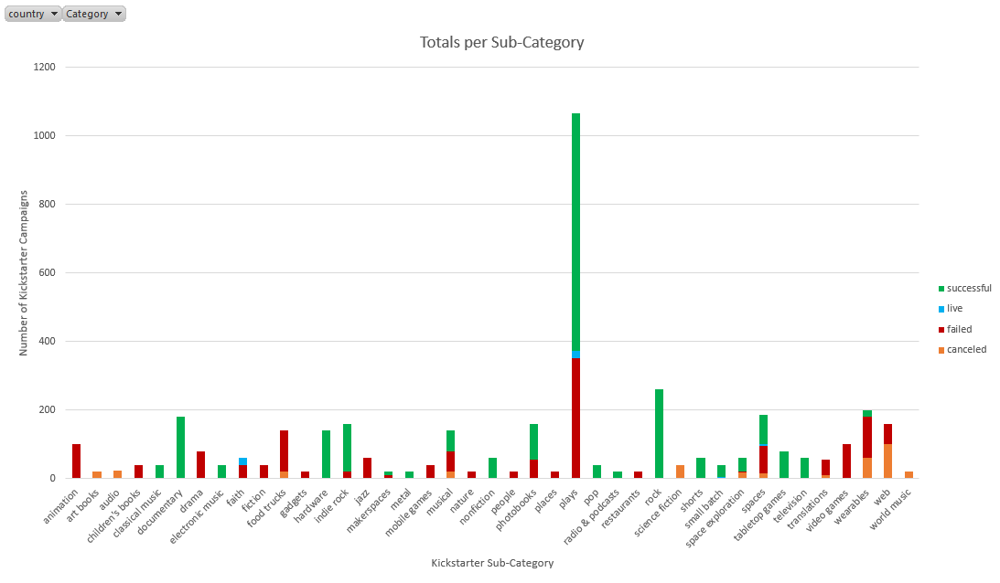

# Excel-Challenge
CWRU Bootcamp HW1 - Excel
*********************
# Objectives
* Analyze given data of 4000 past Kickstarter projects 
* Use Conditional Formatting to highlight specific cells in a certain color based off a desired criteria
* Use Pivot Tables to create stacked column charts and line charts to visualize Kickstarter Data
* Use Summary Statistics to analyze trends of successful and failed Kickstarter projects

*****************
# Contents
* **/Images/** - Saved Pivot Charts in PNG format
* **Kickstarter.xlsx** - Excel sheet of Kickstarter data and analysis
* **Kickstarter Report.docx** - Word document of analysis
******************
# Analysis
•	**Majority of Kickstarter projects were based in the theater category** – Using the Campaign Totals per Category sheet, the Pivot Table shows the 9 different types of main category in the data set. We see the grand totals and the dispersion of the Kickstarter campaigns per category. Looking at the accompanying Pivot Chart, we can easily tell that the category that had the highest amount of campaigns was the Theater category at 1393. The second highest category, Music, had only half as much, at 700. Moving over to the Totals per Sub-Category sheet, we see that Plays were the most common sub- category of Theater. It is the most frequently occurring Kickstarter campaign in the data set.

* **Kickstarters had the lowest success rate in the month of December** – Looking at the Kickstarter Totals per Month sheet, we see a Pivot Table with the amount of Kickstarter campaigns of every state created per month. The Pivot Chart displays a line graph tracking the change in the number of campaigns created through the year. We see the number fluctuate, creating peaks and valleys in both the Successful and Failed states. December, by far, has the lowest amount of Successful campaigns per month with 111. It is also the only month where the number of Failed campaigns exceeds the number of Successful campaigns.

* **Goal amount not a strong indicator of success for a Kickstarter** - Looking at the Outcome Based on Goal $ sheet, we can see a Pivot Line Chart plotting the rates of successful, failed, and canceled campaigns per a range of $5000. While the extreme ends of the ranges had obvious higher success rates and higher failure rates on each respective end, there was no strong indicator if a campaign would be successful or not in the middle ranges.

Additional analysis can be found in Kickstarter Report.docx.
